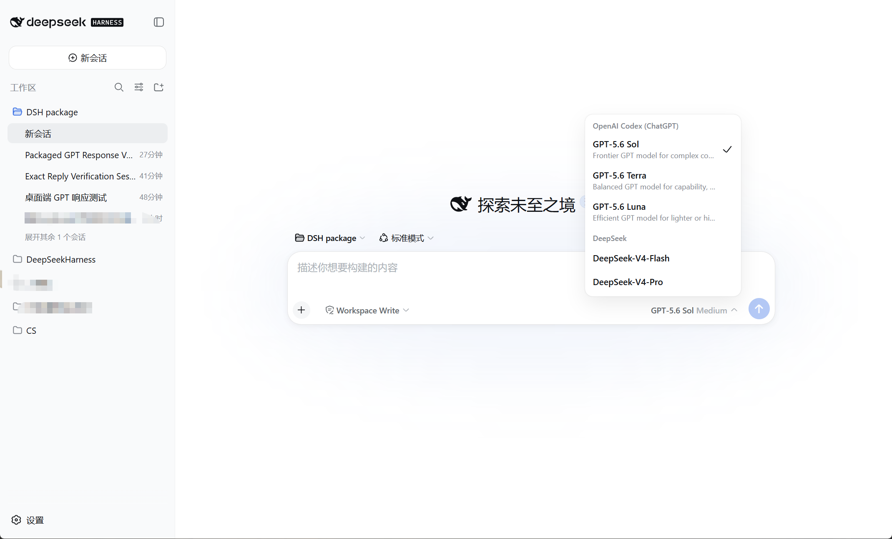

# DeepSeek Harness GPT Desktop

手上已经买了 ChatGPT 会员，DeepSeek API 又觉得有点贵。于是我给刚开源的 DeepSeek Harness 接上了 OpenAI 官方 Codex 登录，再把它包成 Windows 和 macOS 桌面应用。

模型下拉框里，DeepSeek V4 和 GPT-5.6 都在。中美两家 SOTA 模型一起伺候，岂不美哉。



## 它做了什么

- 保留 DeepSeek Harness 原来的界面、工作区和会话记录。
- 增加 `OpenAI Codex (ChatGPT)` 模型提供方。
- 支持 GPT-5.6 Sol、Terra 和 Luna。
- 直接复用 Codex 的 ChatGPT 登录，无需另外填写 OpenAI API Key。
- 使用 Electron 打包成 Windows 和 macOS 桌面应用，关闭窗口时一并清理本地服务。
- DeepSeek V4 Flash 与 V4 Pro 仍然保留，需要时可以随时切回。

官方 Codex CLI 支持使用 ChatGPT 登录，Codex SDK 也允许嵌入本地应用。ChatGPT 计划中的 Codex 用量、模型权限与速率限制仍按 OpenAI 当前规则执行。

- [Codex CLI](https://learn.chatgpt.com/docs/codex/cli)
- [Codex SDK](https://learn.chatgpt.com/docs/codex-sdk)
- [ChatGPT 与 Codex 计划](https://learn.chatgpt.com/docs/pricing)

## 下载和使用

安装包会放在仓库的 Releases 页面。Windows 下载 `.exe`，Apple Silicon Mac 下载 `mac-arm64.dmg`，Intel Mac 下载 `mac-x64.dmg`。首次启动时，如果本机还没有 Codex 登录状态，应用会打开 OpenAI 官方登录页。登录完成后会自动进入 DeepSeek Harness。

已经安装并登录 Codex 的电脑会直接复用现有登录状态。应用不会读取、复制或提交 OAuth Token。

macOS 安装包目前使用临时签名，没有经过 Apple 公证。系统拦截时，可以在“系统设置 → 隐私与安全性”中选择“仍要打开”。如果仍提示应用已损坏，可以在终端执行下面的命令后重新打开。

```bash
xattr -dr com.apple.quarantine "/Applications/DeepSeek Harness GPT.app"
```

## 从源码构建

需要 Node.js 24 和 npm。Windows 安装包应在 Windows 上构建，macOS 安装包应在对应架构的 Mac 上构建。

```powershell
git clone https://github.com/R3hb/deepseek-harness-gpt-desktop.git
cd deepseek-harness-gpt-desktop\desktop
npm install
npm test
npm run dist
```

`npm run dist` 会先准备 DeepSeek Harness rc.7、Codex SDK 0.147.0 与本地适配器，再生成 NSIS 安装包。

macOS 使用下面的命令。Apple Silicon 选择 `--arm64`，Intel Mac 选择 `--x64`。

```bash
cd deepseek-harness-gpt-desktop/desktop
npm install
npm test
npm run dist:mac -- --arm64
```

开发运行可以使用下面的命令。

```powershell
npm start
```

默认工作区是系统文档目录。已有 `E:\DeepSeekHarness\workspace` 时会继续使用它，也可以通过 `DSH_WORKSPACE` 指定目录。`DSH_HOME` 和 `DSH_APP_DIR` 同样可以覆盖默认位置。

## 实现方式

`desktop/codex-llm-plugin` 注册了 `openai-codex` 模型路由。每次 Harness 对话通过官方 `@openai/codex-sdk` 进入 Codex，认证与工具执行都由 Codex 管理。

普通对话只转发用户消息、历史模型回复与工具结果。Harness 注入的整套工具目录会留在自己的会话日志里，不会重复发给 Codex。这样可以少耗一部分输入 token，同时避免让模型误以为那批 Harness 工具可以直接调用。

适配器会把 Codex thread id 写入 Harness 的回放元数据。同一会话下一轮会续接原 thread，多轮上下文不会丢。

## 已知限制

- 当前桥接只接收文本消息，Harness 图片附件尚未转给 Codex。
- Codex 自带 Agent 指令和工具，单轮仍有较大的上下文基线。
- 本机实测 GPT-5.6 Sol 首次响应约需五十到六十秒，速度会受账号、网络与任务复杂度影响。
- 自行构建的安装包没有商业代码签名证书，Windows 可能显示未知发布者。
- macOS 安装包使用临时签名且未经过 Apple 公证，首次打开时会触发 Gatekeeper 提示。
- DeepSeek 模型仍需要自己的 API Key 与额度。ChatGPT 会员不会替 DeepSeek 接口付费。

## 安全边界

- 仓库不包含 API Key、OAuth Token、Cookie、会话数据或个人工作区。
- 传给 Codex 子进程的环境变量会移除名称中含有 `KEY`、`SECRET`、`TOKEN` 或 `PASSWORD` 的项目。
- ChatGPT 登录状态由 Codex 的标准账号目录管理，本适配器只检查是否已经登录。

## 致谢

- [deepseek-ai/deepseek-harness](https://github.com/deepseek-ai/deepseek-harness)
- [openai/codex](https://github.com/openai/codex)

这是个人做的社区版本，和 DeepSeek、深度求索、OpenAI 都没有官方关系。欢迎提 Issue，也欢迎一起把这个桥接做得更顺手。

## License

本仓库新增代码采用 MIT License。第三方组件保留各自许可证，详情见 [NOTICE.md](NOTICE.md)。
